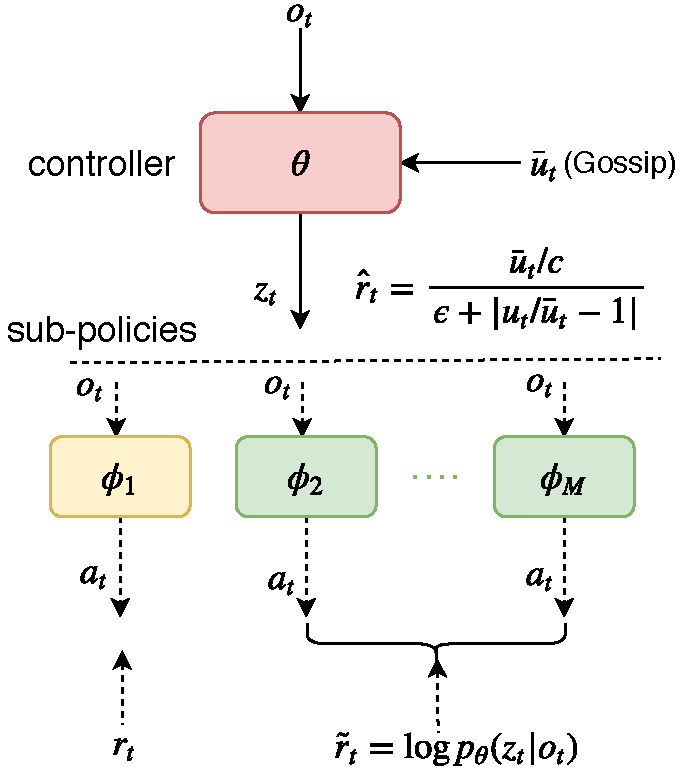

# FEN 

By Jiechuan Jiang and Zongqing Lu

**Peking University**.

### Table of Contents
1. [Introduction](#introduction)
2. [Applications](#applications)
3. [Citation](#citation)

### Introduction

Fairness is essential for human society, contributing to stability and productivity. Similarly, fairness is also the key for many multi-agent systems. Taking fairness into multi-agent learning could help multi-agent systems become both efficient and stable. However, learning efficiency and fairness simultaneously is a complex, multi-objective, joint-policy optimization. **F**air-**E**fficient **N**etwork (**FEN**) is proposed to address these difficulties. 

FEN is a novel hierarchical reinforcement learning model to learn both fairness and efficiency driven by *fair-efficient* reward. FEN consists of one controller and several sub-policies,  where the controller learns to optimize the fair-efficient reward, one sub-policy learns to optimize the environmental reward, and other sub-policies learn to provide diverse fairness behaviors guided by the derived information-theoretic reward. FEN can learn and execute in a fully decentralized way, coordinated by average consensus. It is empirically demonstrated that FEN easily learns both fairness and efficiency and significantly outperforms baselines in a variety of multi-agent scenarios.

The code is the implementations of FEN in the three scenarios, i.e., job scheduling, the Matthew effect and manufacturing pant, presented in the paper [Learning Fairness in Multi-Agent Systems](https://z0ngqing.github.io/publication/nips19/).

### Applications

FEN learns both fairness and efficiency. It emprically outperforms many baselines. FEN is applicable to many real applications, such as task scheduling, network resource allocations, logistics. We expect FEN can be widely applied to many applications where fairness and efficiency are both concerns.  

### Citation

If you are using the code, please cite our paper.

[Jiechuan Jiang and Zongqing Lu. *Learning Fairness in Multi-Agent Systems*. NeurIPS, 2019](https://z0ngqing.github.io/publication/nips19/)

	@inproceedings{jiang2019learning,
		title={Learning Fairness in Multi-Agent Systems},
		author={Jiang, Jiechuan and Lu, Zongqing},
		booktitle={NeurIPS},
		year={2019}
	}
